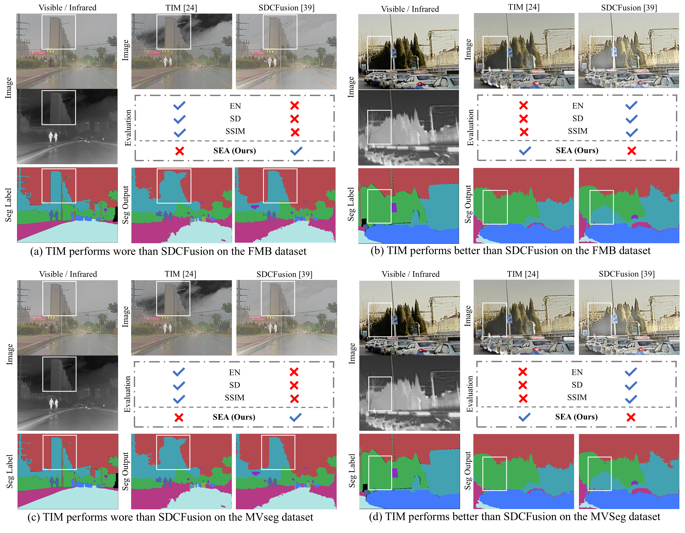

<h1 align="center"> Rethinking the Evaluation of Visible and Infrared Image Fusion </h1>

<h4 align="center">
    <a href="https://scholar.google.com/citations?user=DsLYx7YAAAAJ&hl=en">Dayan Guan</a><sup>1</sup>,
    <a href="https://github.com/Yixuan-Wu-NEU">Yixuan Wu</a><sup>2</sup>,
    <a href="https://www.researchgate.net/profile/Tianzhu-Liu-3">Tianzhu Liu</a><sup>1</sup>,
    <a href="https://ieeexplore.ieee.org/author/37271226200">Alex C. Kot</a><sup>3</sup>,
    <a href="https://scholar.google.com/citations?user=WHkRZscAAAAJ&hl=zh-TW&oi=ao">Yanfeng Gu</a><sup>1</sup>
</h4>

<ul align="center">
  <sup>1</sup>Harbin Institute of Technology</li>
  <sup>2</sup>Northeastern University</li>
  <sup>3</sup>Nanyang Technological University</li>
</ul>

<h5 align="center">

 
[]()
[]()

</h5>

## Examples



## Abstract
Visible and Infrared Image Fusion (VIF) has garnered significant interest across a wide range of high-level vision tasks, such as object detection and semantic segmentation. However, the evaluation of VIF methods remains challenging due to the absence of ground truth. This paper proposes a Segmentation-oriented Evaluation Approach (SEA) to assess VIF methods by incorporating the semantic segmentation task and leveraging segmentation labels available in latest VIF datasets. Specifically, SEA utilizes universal segmentation models, capable of handling diverse images and classes, to predict segmentation outputs from fused images and compare these outputs with segmentation labels. Our evaluation of recent VIF methods using SEA reveals that their performance is comparable or even inferior to using visible images only, despite nearly half of the infrared images demonstrating better performance than visible images. Further analysis indicates that the two metrics most correlated to our SEA are the gradient-based fusion metric $Q_{\text{ABF}}$ and the visual information fidelity metric $Q_{\text{VIFF}}$ in conventional VIF evaluation metrics, which can serve as proxies when segmentation labels are unavailable. We hope that our evaluation will guide the development of novel and practical VIF methods.

# Getting Started

## Installation

1. Environment

```bash
git clone https://github.com/Yixuan-2002/SEA.git
cd SEA
pip install -r requirements.txt
```

2. Install [Segment-Everything-Everywhere-All-At-Once](https://github.com/UX-Decoder/Segment-Everything-Everywhere-All-At-Once/blob/v1.0/assets/readmes/INSTALL.md) and [Grounded-SAM](https://github.com/IDEA-Research/Grounded-Segment-Anything)

3. Download Pretrained Checkpoints to the path ```./checkpoints/```
```bash
wget https://huggingface.co/xdecoder/X-Decoder/resolve/main/xdecoder_focalt_last.pt
wget https://huggingface.co/xdecoder/X-Decoder/resolve/main/xdecoder_focall_last.pt
wget https://huggingface.co/xdecoder/SEEM/blob/main/seem_focalt_v1.pt
wget https://huggingface.co/xdecoder/SEEM/blob/main/seem_focall_v1.pt
```

## Dataset

The data includes the [FMB Dataset]() and the [MVSeg Dataset]().

Download them from the above links, and organize them as follows.

```
├── SEA
│   ├── VIF_Results_FMB
│   │   ├── 2018_DenseFuse
│   │   ├── 2019_FusionGAN
│   │   └── ...
│   ├── VIF_Results_MVSeg
│   │   ├── 2018_DenseFuse
│   │   ├── 2019_FusionGAN
│   │   └── ...
│   ├── ...
```

## Evaluation

- Traditional Evaluation Methods

```bash
sh VIFB.sh
```
Selecting different Datasets by modifying the ```results_folder``` in the python code in ```./VIFB```

- SEA Evaluation Method
  
```bash
sh SEEM.sh
sh xdecoder.sh
sh GroundedSAM.sh
```

# Acknowledgements

- This work is built upon the [SEEM](https://github.com/UX-Decoder/Segment-Everything-Everywhere-All-At-Once), [X-Decoder](https://github.com/microsoft/X-Decoder) and [Grounded SAM](https://github.com/IDEA-Research/Grounded-Segment-Anything).

# Citation

Please consider citing if you find our work useful:
```

```